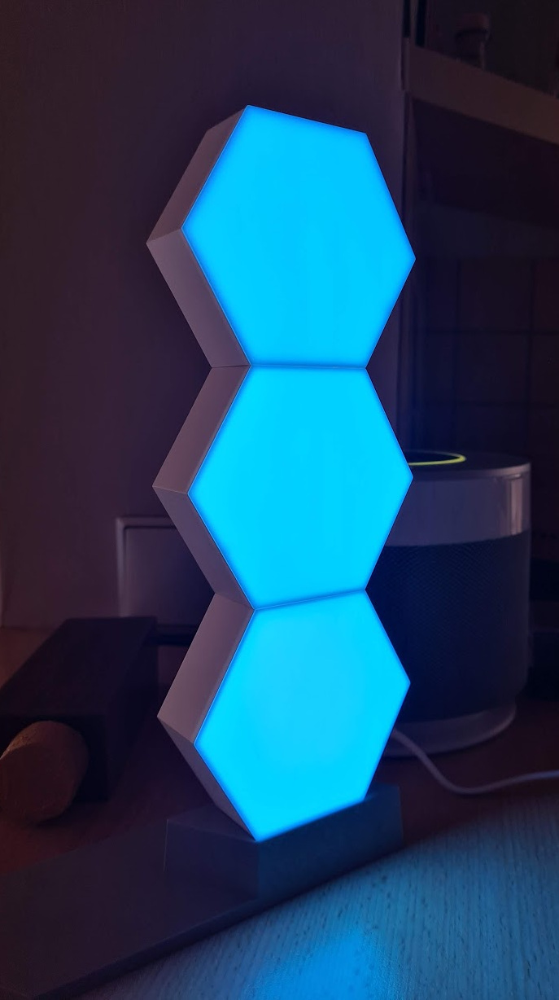

# SolarLight
Use ColoLight to visualize the power generation of SMA inverter 

Cololight: https://cololight.de/

**To get started:**

1) Clone git repo
2) Get IP address for SMA inverter and Cololight
3) Ensure modbus tcp is enabled on your SMA inverter
4) The SMA register numbers are for STP10k inverters, other models might need different register numbers (in Wechselrichter.py)
5) Run Solarlight.py <inverter ip> <cololight ip> 
6) Enjoy the PV Status LEDs 

## LED Colors & Modes

**Grid feed-in (W) colors (Mood, mode 6):**
     
 - \>7000W     Red
 - 6000-7000   Orange
 - 4000-6000   yellow
 - 2500-4000   Green
 - 1500-2500   Grass       
 - 500-1499    Gold
 - 1-500W      Azure
        
**Grid supply (W) colors (Mood, mode 17):**

 - 0-200W     Azure
 - 200-1000W  Pink
 - \>1000W    Red
     
 **Mood mode speed**
 
 Cololight mood mode speed is set depending on the Feed-in/supply W value within the range. 
 Lower values will use lower speed (26) and higher values will go up to speed 32.
 e.g.  Feed-in 1620W  -> Color Grass, Speed 27
       Feed-in 2420W  -> Color Grass, Speed 32e.g.  
       Feed-in 499W  -> Color Azure, Speed 32
        
Thanks to BazaJayGee66 for the Cololight python class ( Github BazaJayGee66 / homeassistant_cololight)
        
